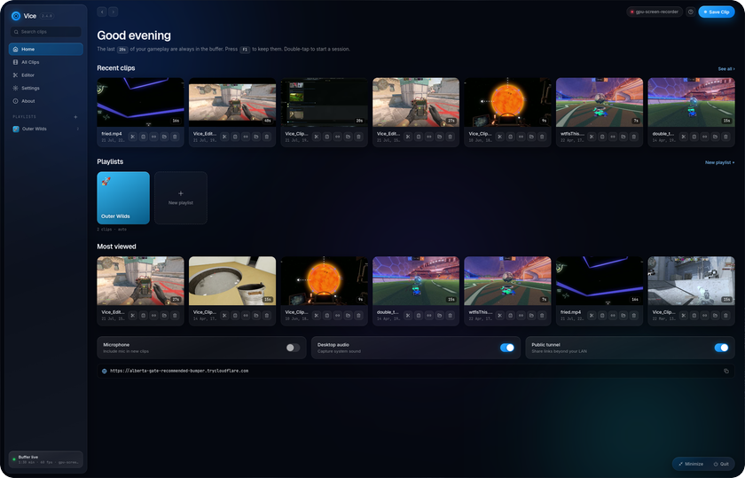
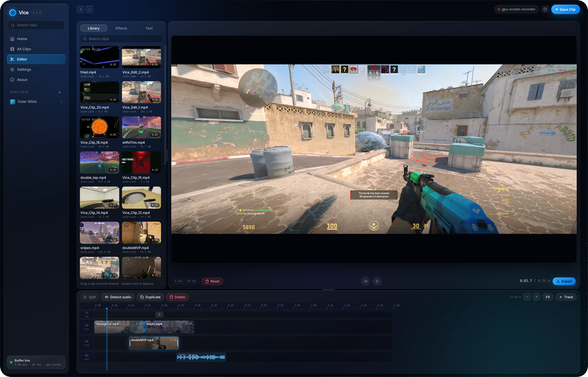
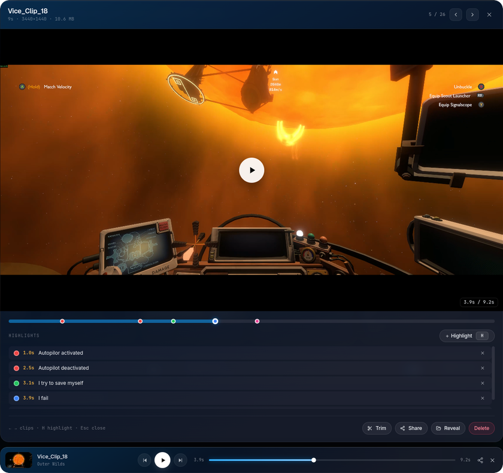
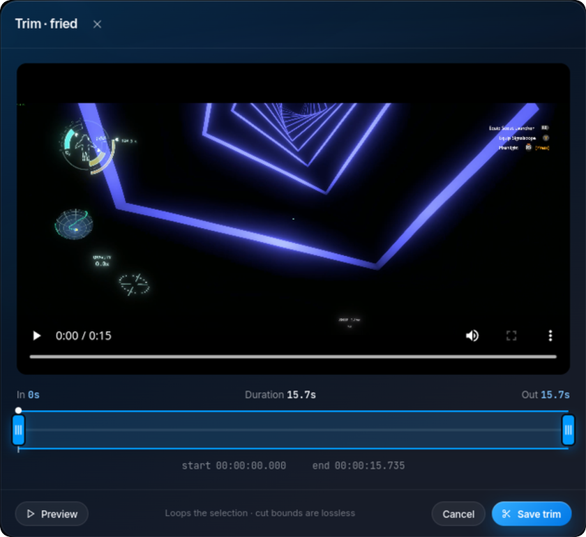

<p align="center">
  
</p>

<h1 align="center">Vice</h1>

<p align="center">
  <b>Instant-replay game clipping for Linux.</b><br/>
  Press one key to save the last 20 seconds of gameplay. No scenes, no setup, no upload.
</p>

<p align="center">
  <a href="https://viceclipper.framer.website/">Website</a> ·
  <a href="#install">Install</a> ·
  <a href="#features">Features</a> ·
  <a href="#configuration">Config</a> ·
  <a href="#troubleshooting">Troubleshooting</a>
</p>

<table align="center">
  <tr>
    <td align="center" width="50%">
      <br/>
      <sub>Home: recent clips, playlists, and quick toggles</sub>
    </td>
    <td align="center" width="50%">
      <br/>
      <sub>Editor: multi-track timeline with clips, text, and audio</sub>
    </td>
  </tr>
  <tr>
    <td align="center" width="50%">
      <br/>
      <sub>Viewer: highlight markers dropped mid-session</sub>
    </td>
    <td align="center" width="50%">
      <br/>
      <sub>Trim a clip in place, no re-encode needed</sub>
    </td>
  </tr>
</table>

---

## Install

**Arch / Manjaro / CachyOS / any Arch-based distro:**

```bash
yay -S vice-clipper     # or: paru -S vice-clipper
```

**Ubuntu / Debian / Mint / Fedora / openSUSE / other:**

```bash
git clone https://github.com/eklonofficial/Vice && cd Vice && ./install.sh
```

Launch **Vice** from your app menu (or run `vice-app`) and press **F9** in a game. If the terminal says `vice: command not found`, restart the terminal first.

Both paths install everything Vice needs, including the `gpu-screen-recorder` capture backend and a systemd user service so clipping starts at login. The script detects your package manager (`apt`, `dnf`, `pacman`, `zypper`) automatically.

| | Update | Uninstall |
|---|---|---|
| AUR | `yay -Syu` | `sudo pacman -Rns vice-clipper` |
| Git clone | `cd Vice && git pull && ./install.sh` | `vice uninstall && rm -rf Vice` |

> Don't mix the AUR package and `./install.sh` on the same machine. Uninstall one before switching.

**Bazzite / Fedora Atomic:** not supported yet. rpm-ostree systems can't use `install.sh`, and the installer exits early on them rather than breaking your system. A Flatpak will fix this; follow [#97](https://github.com/eklonofficial/Vice/issues/97).

---

## Features

**Free and open source.** No account, no subscription, no telemetry. Read the code, change it, ship your own build.

**Share links that just work.** Every clip gets a public URL the moment you save it, no upload step, no size limit. Paste it into Discord and it plays inline as an embed, tinted to match your theme color.

**A real timeline editor, built in.** Multiple video and audio tracks, transitions, and text overlays, all free and included. Trim, arrange, and layer clips into something bigger without leaving Vice.

**Playlists.** Clips file themselves into a playlist for whatever game you were playing, automatically. Make your own for anything else, and drag clips between them.

**Reusable YouTube uploads.** Point Vice at your existing `youtubeuploader` setup, save presets for each game or channel, then upload a clip with the right title, tags, privacy, and YouTube playlists from the viewer.

**Driver-level capture.** Vice runs on `gpu-screen-recorder`, the same approach ShadowPlay uses: it talks to NVENC/VAAPI directly instead of compositing a scene. Typical CPU usage is under 1%, and it works on NVIDIA, AMD, and Intel, on every major compositor.

**Discord Rich Presence.** Shows what game you're clipping right in your Discord status, on by default for known games.

**Clips titled for you.** Vice recognizes the game you're playing from a curated list and names the file accordingly, no guessing from window titles.

**Hotkeys per clip.** Add your own rename-able, color-coded hotkeys to any clip for quick recall later.

**Vice Sessions.** Double-tap your clip key to start recording a full match. Single-tap during the session to drop a marker at that moment, then pick up right where you left off once it lands in the editor.

**Tune it to taste.** Custom `gpu-screen-recorder` flags and arguments, color themes, and fully rebindable hotkeys, all from Settings.

## Using Vice

| Key / Action | What happens |
|---|---|
| **F9** | Save the last 20 s |
| **Extra clip keys** | Save their own duration, e.g. F6 for 60 s (Settings → Hotkeys) |
| **Key combos** | Rebind to a modifier combo like **Alt + F9** (Settings → Hotkeys) |
| **F9 · F9** (double-tap) | Start / stop a session recording |
| **F9** during a session | Drop a highlight at this moment |
| **Click a thumbnail** | Open viewer · ← → next/prev · **H** new highlight · **Esc** close |
| **Share** | Copy the public URL (pastes into Discord as a playable embed) |
| **Upload to YouTube** | Pick a connector, adjust its metadata, upload, and copy the `youtu.be` URL |
| **Trim** | Drag handles to crop a clip in place |

Clips live in `~/Videos/Vice/`. Closing the window keeps the daemon recording; reopen from your launcher any time.

## Why Vice?

OBS has a replay buffer. So why use Vice?

|  | OBS Replay Buffer | Vice |
|---|---|---|
| **Setup time** | Launch OBS, build a scene, enable the buffer, bind a hotkey | Install, press F9 |
| **Always on** | OBS must stay open with a scene active | Silent daemon, always watching |
| **GPU overhead** | Encodes a composed scene continuously | Captures the compositor framebuffer directly. Near zero. |
| **Global hotkey** | OBS must be focused (or use a plugin) | Reads evdev; works on every compositor |
| **Sharing** | Manual upload | Built-in public URL, Discord auto-embed |
| **Clip management** | None | Gallery, viewer, trim, highlights, rename |

## Compatibility

| Compositor / Shell | | GPU | |
|---|---|---|---|
| Hyprland (Wayland) | ✅ | NVIDIA | ✅ NVENC |
| GNOME (Wayland) | ✅ | AMD / Intel | ✅ VAAPI |
| KDE Plasma (Wayland) | ✅ | Anything else | ✅ libx264 software fallback |
| sway (Wayland) | ✅ | | |
| Any X11 WM | ✅ | | |

`gpu-screen-recorder` is the default backend everywhere. `wf-recorder` (Wayland) and `ffmpeg x11grab` (X11) exist as explicit opt-ins via `recording.backend` for unusual setups; they are never auto-selected.

Game detection works natively on Hyprland and sway, and through X11/XWayland on Plasma, GNOME, and X11 window managers. The installer includes the required `xdotool`, `xprop`, and `wmctrl` utilities.

## CLI

```
vice start          Start the recording daemon
vice start --no-open-ui
                    Start the daemon without opening the browser UI
vice stop           Stop the daemon
vice clip           Save a clip right now
vice status         Show daemon status, backend, and share URL
vice ui             Open the web UI in your browser
vice clips          List saved clips
vice config         Print current config
vice open-config    Open config in $EDITOR
vice list-keys      Show valid hotkey names (KEY_F9, KEY_INSERT, …)
vice doctor         Run startup diagnostics
vice uninstall      Remove Vice cleanly
```

The systemd user service created by the installer runs `vice start --no-open-ui`, so Vice clips at login without opening a window. Custom systemd/Nix units can use the same command.

## Configuration

Vice writes `~/.config/vice/config.toml` on first run. Everything below is also editable live from the GUI.

```toml
[recording]
buffer_duration = 120     # seconds kept in the rolling buffer
clip_duration   = 20      # seconds saved per clip
fps             = 60
display         = "DP-1"  # optional; omit to use the backend default display
encoder         = "auto"  # auto | h264_nvenc | hevc_nvenc | h264_vaapi | hevc_vaapi | libx264 | libx265
backend         = "auto"  # auto | gsr | wf-recorder | ffmpeg
container       = "mp4"   # mp4 | mkv (mkv is crash-safe; Discord embeds need mp4)
capture_audio   = true
capture_microphone = false
microphone_source = "default_input" # default_input | device:name; which mic to capture
gsr_audio_source = "default_output" # default_output | device:name | app:name | app-inverse:name
audio_tracks    = []      # separate tracks instead of a mix, e.g. ["default_output", "default_input", "app:Discord"]
audio_tracks_mix_first = false # also record a track 1 that mixes every source
gsr_args        = ""      # extra gpu-screen-recorder flags, e.g. "-k hevc -bm cbr -q 20000"

[hotkeys]
clip = "KEY_F9"

[[hotkeys.clip_presets]]
key = "KEY_F6"
duration = 60

[[hotkeys.clip_presets]]
key = "KEY_F7"
duration = 120

[output]
directory = "~/Videos/Vice"
tag_clips_with_game   = true  # Vice_Clip_4_Overwatch-2.mp4 when a known game is focused
auto_playlist_by_game = true  # file each clip into a per-game playlist
clip_name_template    = ""    # optional: e.g. "clip_$date_$time"; empty keeps default naming

[sharing]
enabled           = true
port              = 8765  # local control UI (always 127.0.0.1)
public_port       = 8766  # public share-only server (defaults to port + 1)
cloudflare_tunnel = true
base_url          = ""    # optional public origin override (reverse proxy / custom domain)

[discord]
enabled             = true   # shows Rich Presence when a known/custom game is focused
show_game_indicator = true   # show the detected supported game above Buffer live
client_id_override  = ""     # leave blank to use Vice's default Discord app
# Add custom games via Settings → Discord. Each line is "Display Name | match1, match2".

[youtube]
executable = "youtubeuploader"  # binary name on PATH, or an absolute path

[[youtube.connectors]]
id                   = "cs2"
name                 = "CS2"
secrets_path         = "/home/me/.config/youtubeuploader/client_secrets.json"
cache_path           = "/home/me/.config/youtubeuploader/request.token"
oauth_port           = 8080
title_template       = "$filename"
description          = "CS2 Clip"
privacy              = "unlisted"
tags                 = ["CS2"]
playlist_ids         = ["PLkkUbU417dlRPsEdKJ0iAbWyLn420R8C8"]
notify               = false

[updates]
check_on_start = true   # ask GitHub once a day whether a newer release exists
```

Notes:

- `updates.check_on_start` asks the GitHub releases API at most once a day whether a newer Vice is out, and shows a notice with a few lines from the release notes when there is. Nothing about you or your clips is sent, the notice appears once per release and leaves only a small chip in the top bar after you dismiss it, and a failed check is silent. Turn it off in Settings → Advanced, or with this key.

- `recording.audio_tracks` records each listed source as its own audio track, in order. Browsers and Discord play only track 1; video editors see all of them. Tracks can be reordered from Settings → Recording. With mic capture on, the microphone is added as its own track. `audio_tracks_mix_first` adds an extra track 1 that mixes every source, so shared clips carry full audio. `container` and `audio_tracks` apply to the gpu-screen-recorder backend; wf-recorder/ffmpeg clips stay single-track MP4.
- `recording.microphone_source` picks which microphone the mic toggle captures. `default_input` follows the system default; `device:<name>` pins a specific input without changing your system setting.
- `recording.gsr_args` supports environment/tilde expansion and a `{default_sink_monitor}` placeholder for desktop-audio capture.

## YouTube uploads

YouTube support is optional and wraps [porjo/youtubeuploader](https://github.com/porjo/youtubeuploader), the same standalone CLI used by terminal upload functions. The git-clone installer preserves any existing copy on `PATH`; otherwise it downloads a pinned official Linux release to `~/.local/bin` and verifies its published SHA-256 checksum. Vice only updates or removes uploader copies carrying its managed-version marker. An unsupported architecture or failed optional download does not block Vice installation. You can install the uploader manually or set its absolute path in **Settings → YouTube** instead. Vice does not install another Google API client and never stores the contents of your OAuth files.

Before creating a connector, follow the uploader's [YouTube API setup](https://github.com/porjo/youtubeuploader#youtube-api): enable YouTube Data API v3, create a Web application OAuth client, and register `http://localhost:8080/oauth2callback` (or the port selected in the connector). Run the uploader once from a terminal with the same secrets and cache paths to complete browser authentication:

```bash
youtubeuploader -filename /path/to/a/test-clip.mp4 \
  -privacy private \
  -secrets "$HOME/.config/youtubeuploader/client_secrets.json" \
  -cache "$HOME/.config/youtubeuploader/request.token"
```

That first command uploads the selected test clip and creates `request.token`; the CLI has no authentication-only command. If you already use `youtubeuploader`, point the connector at your existing `client_secrets.json` and `request.token`. Absolute paths are recommended because Vice normally runs as a background service with a different working directory from your terminal.

Each connector can represent a metadata preset, a YouTube playlist, or a separate account. Title templates support `$filename`, `$game`, `$date`, and `$time`. Upload completion copies the `youtu.be` URL through the same clipboard fallback used by Share. If the video is created but a later playlist assignment fails, Vice still returns the URL and warns you not to retry, avoiding a duplicate upload.

Google applies two important limits outside Vice's control:

- New, unaudited API projects created after July 28, 2020 can upload videos only as `private`, even when another privacy value is requested.
- The default YouTube Data API quota typically permits about six uploads per day. OAuth refresh tokens for an External consent screen in **Testing** can also expire after seven days; authenticate again from a terminal or publish the consent screen when appropriate.

## Troubleshooting

**`vice: command not found` after install.** Restart your terminal, or run `exec $SHELL` (fish: `exec fish`).

**App launcher icon does nothing.** Check `~/.local/share/vice/vice-app.log`. Most common cause: `gpu-screen-recorder` is missing from PATH. If the log mentions `autoaudiosink not found`, install your distro's GStreamer base/good plugin packages.

**Hotkey not firing.** Add yourself to the `input` group:
```bash
sudo usermod -aG input $USER && newgrp input
```

**Hotkey stopped after unplugging the keyboard.** Fixed in v1.2.0; Vice reattaches within a few seconds of replugging. Update if you're on an older version.

**Daemon can't find the Wayland session when started by systemd or the app launcher.** On Hyprland/Sway, the systemd user instance often doesn't inherit `WAYLAND_DISPLAY` from the compositor. Add to your compositor config:

Hyprland (`~/.config/hypr/hyprland.conf`):
```
exec-once = systemctl --user import-environment WAYLAND_DISPLAY DISPLAY DBUS_SESSION_BUS_ADDRESS XDG_RUNTIME_DIR XDG_SESSION_TYPE XDG_CURRENT_DESKTOP
exec-once = dbus-update-activation-environment --systemd WAYLAND_DISPLAY DISPLAY DBUS_SESSION_BUS_ADDRESS XDG_CURRENT_DESKTOP
```

Sway (`~/.config/sway/config`):
```
exec systemctl --user import-environment WAYLAND_DISPLAY DISPLAY DBUS_SESSION_BUS_ADDRESS XDG_RUNTIME_DIR XDG_SESSION_TYPE XDG_CURRENT_DESKTOP
exec dbus-update-activation-environment --systemd WAYLAND_DISPLAY DISPLAY DBUS_SESSION_BUS_ADDRESS XDG_CURRENT_DESKTOP
```

Restart your compositor session, then `systemctl --user restart vice.service`.

**Share link only works on my local network.** Enable the tunnel in Settings → Sharing and make sure `cloudflared` is installed. cloudflared is the only supported tunnel; if it's missing, Vice shows an error in the UI instead of generating a broken link.

**YouTube connector is not ready.** Confirm that the configured executable, `client_secrets.json`, and `request.token` paths exist. If the token is missing or expired, run one terminal upload with the connector's exact `-secrets`, `-cache`, and `-oAuthPort` values, finish the browser prompt, then retry from Vice.

**Clip won't embed on Discord.** Discord only inlines videos up to about 50 MB; trim the clip or lower CRF/resolution. Links also stop working when the Vice daemon restarts, since a fresh tunnel URL is generated each run; repost the link after a restart. MKV clips don't embed; use the default MP4 container for sharing.

**Clips show a grey box inside Vice but play fine in other apps.** The Qt WebEngine build Vice is running has no H.264 decoder. This happens when the installer fell back to the PyPI `PyQt6-WebEngine` wheel, which ships without proprietary codecs; distro packages include them. Install the system package, then reinstall Vice: `sudo apt install python3-pyqt6.qtwebengine` (Debian/Ubuntu/Mint), `sudo dnf install python3-pyqt6-webengine` (Fedora), `sudo zypper install python3-qt6-webengine` (openSUSE), then `./install.sh` again. Since v1.2.6 the app detects this and says so instead of showing a grey rectangle, and the player offers "Open in system player" as a fallback.

**UI looks like plain unstyled HTML right after an upgrade.** The previous daemon is still running old code in memory. Run `vice stop && vice-app` once. `vice-app` self-heals from the next upgrade onward.

**Native window is laggy.** On NVIDIA, Chromium occasionally fails GPU compositing at launch; Vice detects it and relaunches that run in software mode with reduced visual effects. Nothing is remembered, so just close and reopen the window to try the GPU again. `~/.local/share/vice/vice-app-stderr.log` shows what happened on the last launch. Vice prefers QtWebEngine (Chromium, GPU-accelerated) and only falls back to WebKit2GTK if the Qt bindings are missing. Install them: `sudo pacman -S python-pyqt6-webengine` (Arch), `sudo apt install python3-pyqt6.qtwebengine` (Debian/Ubuntu), `sudo dnf install python3-pyqt6-webengine` (Fedora). Then run `vice-app`; the log should say `Using QtWebEngine (Chromium) backend`.

**Native window crashes when I click a button.** Reproduce it in debug mode:
```bash
vice stop
vice-app --debug
# reproduce the crash, then Ctrl+C if the window didn't exit
```
The log lands at `~/.local/share/vice/vice-debug.log`; attach it to a GitHub issue. Don't pipe the command through `tee`: Chromium's stderr can back up through the pipe and freeze the Qt event loop.

**Anything else.** Run `vice doctor` for full diagnostics, or open an issue with the output.

---

## Star History

https://www.star-history.com/?repos=eklonofficial%2FVice&type=date&legend=top-left 

## Credits

Created by **Andrew Marin** ([github.com/eklonofficial](https://github.com/eklonofficial)). Bug reports and PRs welcome.

## License

[GPL-3.0](LICENSE)
